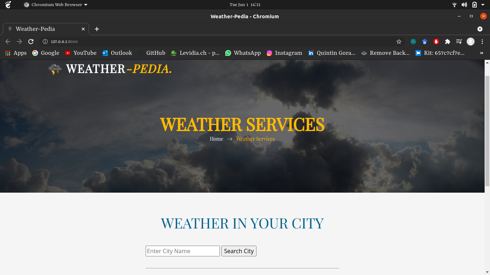
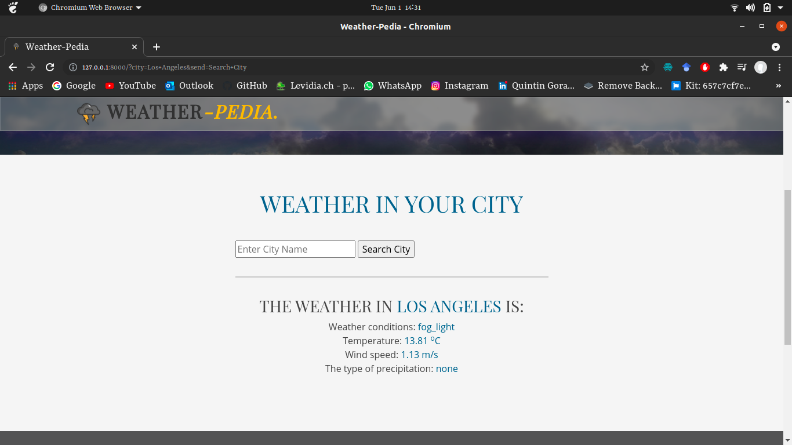

# Weather-Pedia
This online application is created using Django Framework with Python and allows users to enter the names of different cities around the world to view their current weather conditions. All the data provided is in real time and not historic data.
## Follow Steps 
- Download the code and open in IDE.
- Create a virtual environment on your system.
- Install all packages listed in the Requirements.txt file
- Enjoy using the application!!
## ScreenShot 1

## ScreenShot 2

